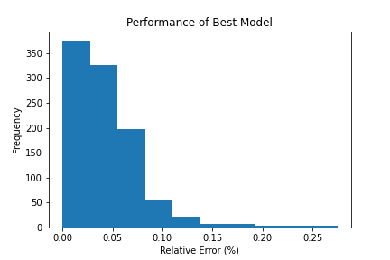

# TabularRegressorClassifier
This module aims to build Regression or Classification models for any type of tabular data, through the use of autoML.

## Example of use

### Creating Model
```
import pandas                  as     pd
import numpy                   as     np
import TabRegClf.analyseClass  as     cl
import autokeras               as     ak
from   tensorflow.keras.models import load_model
import tensorflow              as     tf
import matplotlib.pyplot       as plt

#Load data
data = pd.read_csv("./data/data.csv", index_col=[0])
target = 'var4'
analyse_type = 'Regression'

# Create, train and test
tab = cl.TabularAnalyse(data, target, analyse_type)
tab.get_analyse_type()
tab.get_data()
tab.get_target()
tab.create_model(max_trials= 3, epochs = 10000)
```

### Evaluating the Result
```
# Load best model obtained
loaded_model = load_model("./structured_data_regressor/best_model", 
                            custom_objects=ak.CUSTOM_OBJECTS)

# Let's apply the model to the entire database
x_test = data.iloc[[0], :-1] 
x_test = data.iloc[:, :-1] 
yp = loaded_model.predict(x_test)
yt = data.iloc[:, -1].values.reshape(-1, 1)
error_per = np.abs(yp - yt)/yt * 100
plt.hist(error_per)
plt.title("Performance of Best Model")
plt.xlabel("Relative Error (%)")
plt.ylabel("Frequency")
plt.savefig("./images/fig")

```
.
<br>
As we can see, the relative error was concentrated in values ​​around 0.05%, which represents an excellent result for the regression model.